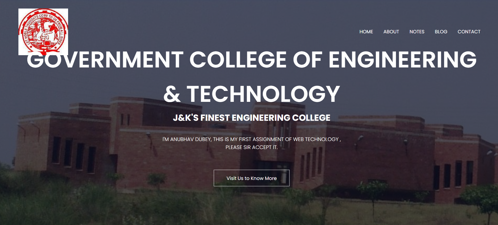
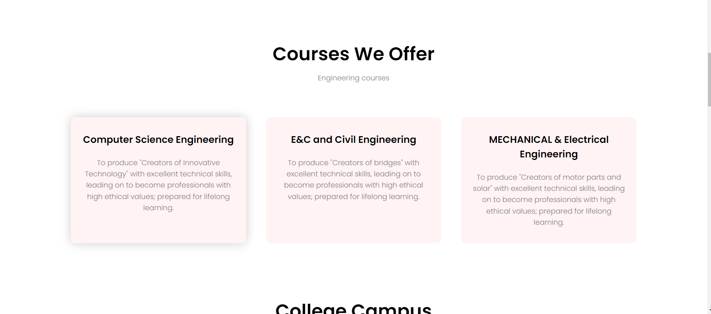
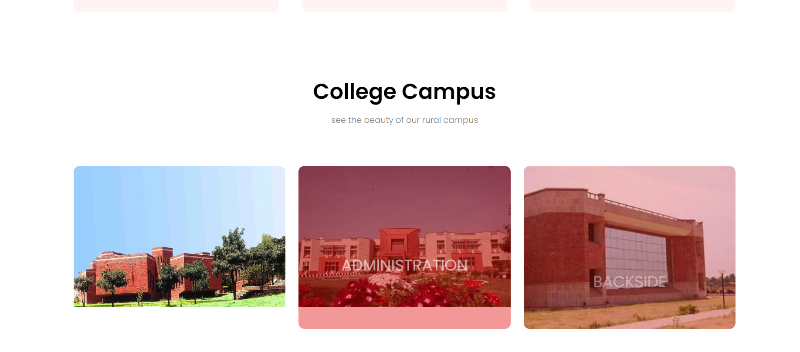
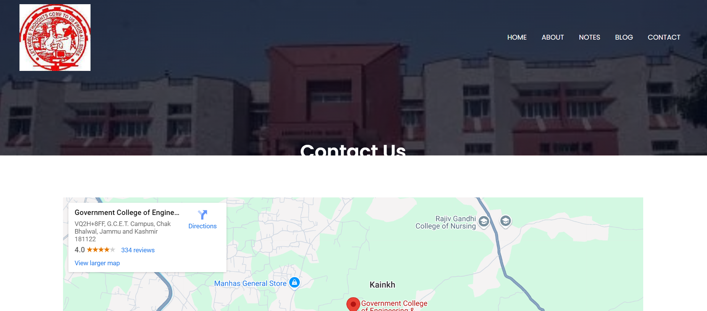

# Anubhav_gcet
Making everything what we can
See my Website here [open form here>>>>]( https://experiencegcet.netlify.app
)

---

# Government College of Engineering & Technology (GCET) Website

## Overview

This project is a basic informational website for Government College of Engineering & Technology (GCET), Jammu, developed as a part of a web technology assignment. The website provides information about the courses offered, facilities, campus culture, and other details about the college. 

### Table of Contents

- [Features](#features)
- [Technologies Used](#technologies-used)
- [Structure](#structure)
- [How to Run](#how-to-run)
- [Screenshots](#screenshots)
- [Contact Information](#contact-information)

## Features

1. Responsive Navigation Bar: The site features a responsive navigation bar for easy access to different sections of the website.
2. Courses Information: Lists the courses offered by the college.
3. College Campus Section: Includes images showcasing different parts of the college campus.
4. Facilities Overview: Highlights various facilities available at the college.
5. Student alumni: Displays feedback from alumni.
6. Call to Action: Encourages enrollment through JKBOPEE JKCET exam.
7. Footer Section: Includes social media links and contact details.

## Technologies Used

- HTML5: Structure of the website.
- CSS3: Styling of the webpage.
- Google Fonts & Font Awesome: Provides additional fonts and icons to improve the appearance of the website.
- JavaScript: Used for toggling the responsive navigation bar.

## Structure

- Header Section: Contains the college logo, navigation menu, and introduction.
- Courses Section: Describes the different engineering programs offered by the college.
- Campus Section: Shows images and details of various parts of the campus.
- Facilities Section: Highlights the facilities and campus culture of GCET.
- Testimonials Section: Provides testimonials from past students.
- Call to Action: Motivates visitors to enroll through the provided contact link.
- Footer Section: Includes information about the college, social media links, and contact details.

### JavaScript Functionality

- **Menu Toggle**: The `showMenu()` and `hideMenu()` JavaScript functions allow the user to open and close the navigation bar on mobile devices.

## How to Run

1. Download or clone the repository.
2. Ensure that all the required image files are present in the `images` folder.
3. Open the `index.html` file in your preferred browser.

## Screenshots

## Contact Information

- **Developer**: Anubhav Dubey
- **College**: Government College of Engineering & Technology, Jammu
- **Phone**: +916005871542
- **WhatsApp**: [WhatsApp Link](https://chat.whatsapp.com/FnhzBpbdbBIJX1i3jmC88X)

---
